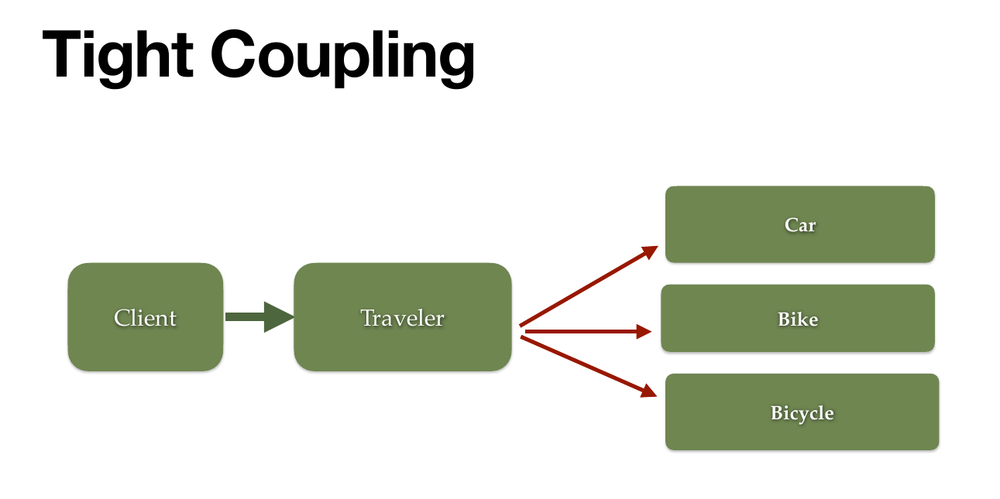
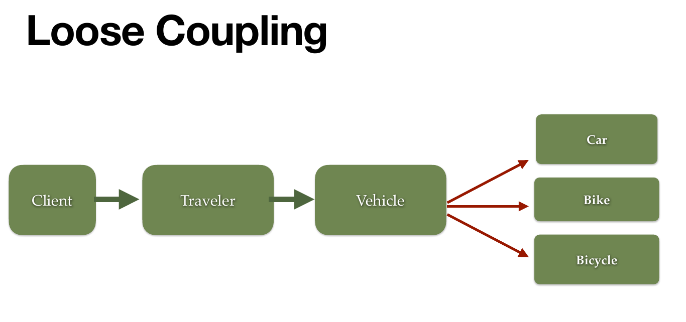
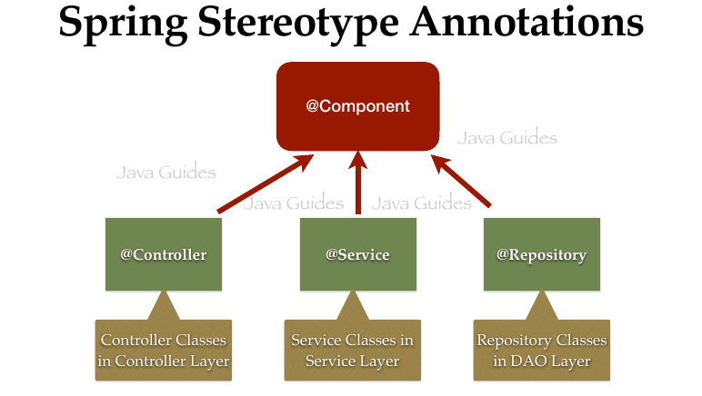
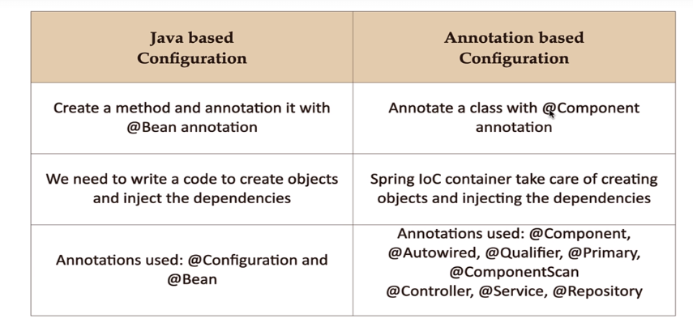
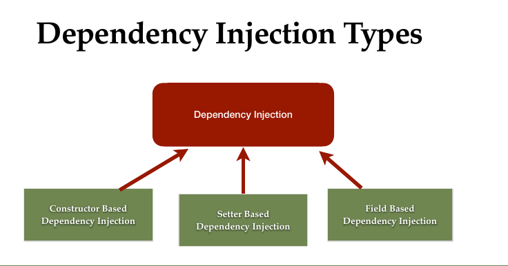
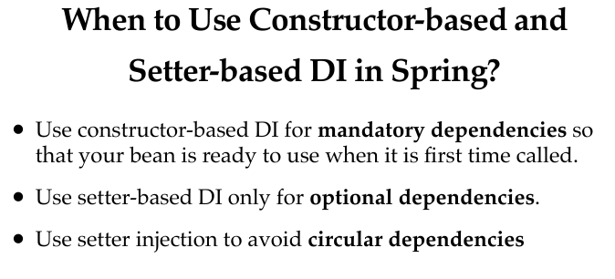
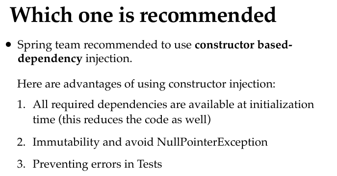
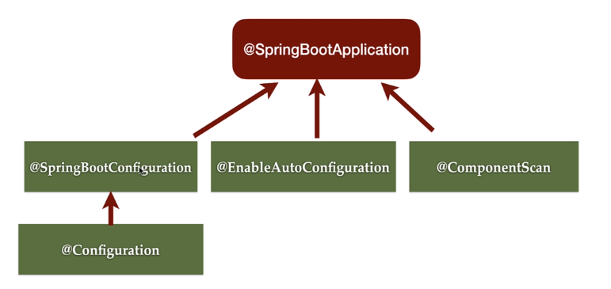
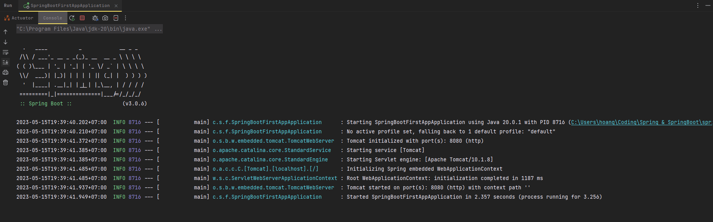

# SPRING & SPRING BOOT

## 1. Section 1 : Introduction.

## 2. Section 2 : Spring Core - Spring IoC Container and Java Based Configuration.

### 2.1 Tight Coupling - Loose Coupling and Loosely Coupled.

Tight Coupling (Liên kết ràng buộc cao) : để chỉ những class có độ phụ thuộc vào nhau cao, điều này dẫn dến khi có sự thay đổi, thêm sửa xóa class, đối tượng sẽ làm thay đỏi những thành phần class còn lại của chương trình.

Loose Coupling (Liên kết ràng buộc thấp)  : Trái ngược với Tight Coupling thì Loose Coupling  khuyến khích thiết kế các class, các lớp có độ phụ thuộc vào nhau thấp, riêng biệt, giảm sự liên quan dến nhau trong chương trình .

> Loosely Coupled là kĩ thuật làm giảm sự phụ thuộc giữa các lớp, đối tượng. Chuyển đổi từ *Tight Coupling* sang *Loose Coupling*.





### 2.2 The IoC Container

> IoC (Inversion of Control) : Đảo ngược trình điều khiển, IoC Priciple còn được biết đến với **Dependency Injection** (Tiêm sự phụ thuộc). Ngyên tắc này sẽ xử lí để các objects có thể xác định được các phụ thuộc của chúng

Spring IoC Container là trái tim của ứng dụng Spring. Nó như một container (thùng chứa) có nhiệm vụ quản lí vòng đời (Life-cycle) của các Beans, khởi tạo, cấu hình, và tương tác với Bean trong ứng dụng Spring.

Bean : là các đối tượng trong ứng dụng Spring.

Ta có thể cấu hình Spring IoC bằng 3 kiểu sau :

- XML based Configuration.
- Annotation based Configuration.
- Java based Configuration.

Spring Framewor hỗ trợ 2 loại container giúp chúng ta khởi tạo và quản lí các beans (đối tượng) trong Spring.

- BeanFactory.
- ApplicationContext.

BeanFactory là *Interface* trên cùng của **Spring IoC Container**, còn ApplicationContext là subclass (lớp con) của BeanFactory. Sự khác nhau chính BeanFactory và ApplicationContext là :

- BeanFactory : Các *bean* được tạo ra khi chúng ta gọi phương thức **getBean()**.
- ApplicationContext : Chúng ta không cần phải chường phương thức **getBean()** được gợi mới tạo **Bean**. Mà khi container được khởi động (start) thì bean cũng đã được tạo mà không cần phải chờ phương thức **getBean()**.

Java Based Configuration :

- @Bean : Xác định class là một bean. Được sử dụng để chỉ định một phương thức trong một class cấu hình (Class được đánh dấu là `@Configuration`) là một phương thức tạo và cấu hình một bean. Phương thức này trả về một đói tượng và Spring sẽ quản lí đối tượng đó như một Bean.
- @Configuration : Xác định class config các bean trong IoC Container. Được sử dụng để đánh dấu một class là một lớp cấu hình. Trong class được đnahs dấu bằng `@Configuration` ta có thể sử dụng các phương thức đánh dấu bằng `@Bean` để tạo và cấu hình.

## 3. Section 3 : Spring Core  - Annotation Based Configuration.

> Lưu ý : Trong ứng dụng Spring thì chúng ta sử dụng kết hợp giữa *Java Based Configuration* và *Annotation based Configuration.

#### 3.1 Một số Annotation và chắc năng của chúng :

- @Component : Được sử dụng để đánh dấu một class là một Spring Bean. Khi một class được đánh dấu là @Component, Spring sẽ tự động tạo một **Instance** của class đó và quản lí nó trong Container của Spring (với tên của component mặc định chính là tên của class). Ta có thể đặt tên cho Component `@Component("<tên của component>")`
- @Autowired : Được sử dụng để tiêm các Dependency (phụ thuộc)  vào một *Bean*. Khi ta đánh dấu một trường, một phương thức hoặc một contructor là `@Autowired`, Spring sẽ tự động xác định chức và tiêm phụ thuộc, và tiêm các bean tương ứng vào đó. Lưu ý : **@Autowired không bắt buộc khi sử dụng `Constructor-Based DI` nếu chỉ có 1 constructor được sử dụng, nếu có nhiều constructor thì ta phải sử dụng annotation @Autowired để xác định constructor nào được tiêm phụ thuộc.
- @Qualifier : được sử dụng với `@Autowired` dùng để xác định rõ *Bean* nào được Inject(tiêm vào) trong trường hợp chó nhiều bean cùng kiểu được đánh dấu để thêm vào một dependency.
- @Primary : được sử dụng để xác định một bean là bean được ưu tiên cao nhất  (Primary Bean) trong trường hợp có nhiều bean cùng kiểu. Khi một Dependency được tiêm vào và có nhiều bean cùng kiểu, Spring sẽ sử dụng bean được đánh dấu là `@Primary`.   Ta có thể sử dụng  `@Qualifier` để xác định bean nào được tiêm vào thay cho @Primary Annotation.
- @Controller, @Service, @Repository : Đây là các Component của Annotation `@Component` , được sử dụng để đánh dấu các class với mục đích xác đinh chức năng cụ thể của class đó trong kiến trúc ứng dụng. (***Phần này sẽ được nói rõ hơn ở phần sau***).

  

#### 3.2 Stereotype Annotations :

Stereotype là nhóm các annotations đưuọc sử  dụng để đánh đấu các class với một vai trò cụ thể trong kiên trúc ứng dụng. Các Stereotype Annotations bao gồm :

- @Component.
- @Configuration.
- @Controller, @Service, @Repository.

Chúng giúp Spring xác đinh và quản lí các class và bean tương ứng trong quá trình IoC (Inversion of Control) và DI (Dependency Injection).

> @Component là main Stereotye Annotation, các Annotations còn lại dirived from (có nguồn gốc) từ @Component.

- @Controlller : được sử dụng để đánh dấu một clas trong ứng dụng là một Controller. Controller là thành phần quản lí việc điều phối các yêu cầu (Requests) từ Client và xử lí các logic liên quan. Thông thường các **phương thức** trong `@Controller` sẽ được đánh dấu là `@RequestMapping` để xác định các URL mà Controller xử lí.
- @Service : được sử dụng để đnahs dấu một class là một Service trong kiến trúc ứng dụng. `@Service` cho biết rằng class là một thành phần chịu  trách nhiệm vụ xử lí các nghiệp vụ (Business Logic). Nó thường thực hiện các tác vụ liên quan đến xử lí dữ liệu, gọi đến các Repository và thực hiện các tính toán.
- @Repository : được đánh dấu một class là một Repository trong kiến trúc ứng dụng. @Repository cho biết rằng class chịu trách nhiệm truy xuất và lưu trữ dữ liệu vào cơ sở dữ liệu hoặc các nguồn dữ liệu khác. Thông thường nó cung cấp các phương thức với cơ sở dữ liệu như thêm, sửa, xóa.

#### 3.3 Sự khác nhau giữa Java Based Configuration và Annotation Based Configuration.



## 4. Section 4 : Spring Core - Dependency Injection.

#### 4.1 Dependency Injection.

Dependency Injection (DI) là một nguyên tắc thiết kề phần mềm và một trong những tính năng cốt lõi của Spring Framework. Nó cho phép bạn ***loại bỏ sự phụ thuộc*** cứng giữa các thành phần trong ứng dụng và tạo ra các thành phần có thể tái sử dụng, dễ kiểm thử và dễ bảo trì.

Trong Spring, DI được thực hiện thông qua việc cấu hình các dependency và để Spring quản lý việc khởi tạo và cung cấp các dependency đó cho các thành phần cần sử dụng.

#### 4.2 Without Dependency Injection.

Như trong định nghĩa chức năng ở trên của Dependency Injection thì nhiệm vụ chính của nó là làm giảm sự phụ thuộc giữa các thành phần của ứng dụng. Ngoài việc sử dụng DI thì ta có thể sử dụng *Java Interface*  để tạo ra lớp chung

#### 4.3 Dependecy Injection Types.



##### 4.3.1 Constructor Based Dependency Injection

Constructor Based Dependency Injecion : là một kiểu DI trong Spring Framework mà các dependency được chuyển vào thông qua constructor của class. Đây là một kiểu DI mạnh và được khuyến khích sử dụng trong Spring.

```java
@Service
public class UserService {
    private final UserRepository userRepository;

    @Autowired
    public UserService(UserRepository userRepository) {
        this.userRepository = userRepository;
    }

    public UserService() {
        // Constructor mặc định
    }
}

```

> Annotation @Autowired trong Spring Framework không bắt buộc khi sử dụng với Constructor Based DI trong trường hợp chỉ có duy nhất một constuctor được sử dụng. Khi có nhiều hơn ta phải thêm Annotation vào Constructor được chỉ định để tiêm phụ thuộc (Dependency).

##### 4.3.2 Setter Based Dependency Injection

Setter Based Dependency Injection : là một kiểu DI trong Spring mà các dependency được truyền thông qua phương thức **Setter** của class. Khác với Constructor based DI thì Setter based DI phải sử dụng Annotation @Autowired để chỉ định rằng đây là một setter được sử dụng cho DI.

```Java
@Service
public class UserService {
    private UserRepository userRepository;

    @Autowired
    public void setUserRepository(UserRepository userRepository) {
        this.userRepository = userRepository;
    }
}

```

##### Sự khác nhau giữa Constructor Based DI và Setter Based DI ?

| Setter-based DI                                                                        | Constructor-based DI                                             |
| -------------------------------------------------------------------------------------- | ---------------------------------------------------------------- |
| Sử dụng phương thức setter để thiết lập dependency                            | Chuyển dependency vào thông qua constructor                   |
| Dependency không bắt buộc và có thể để giá trị null                          | Dependency bắt buộc và không thể bỏ sót                   |
| Sử dụng annotation `@Autowired` trên phương thức setter                        | Không cần annotation `@Autowired` với constructor duy nhất |
| Linh hoạt trong việc thay đổi dependency sau khi bean<br />đã được khởi tạo | Rõ ràng về sự phụ thuộc và dễ đọc, test và bảo trì  |

##### Khi nào thi nên sử sử dụng Constructor based DI và Setter based DI ?

| Constuctor Based DI                                                                                                                                                                                                   | Setter Based DI                                                                                                                                                       |
| --------------------------------------------------------------------------------------------------------------------------------------------------------------------------------------------------------------------- | --------------------------------------------------------------------------------------------------------------------------------------------------------------------- |
| Khi các Dependency được coi là bắt buộc và không thể bỏ sót.                                                                                                                                              | Khi các Dependency không bắt buộc và có thể bỏ sót                                                                                                           |
| Constructor based DI làm cho sự phụ thuộc rõ rằng hơn vì được<br />truyền vào thông qua constructor khi khởi tạo bean.                                                                                | Setter Based DI linh hoạt hơn trong việc thay đổi dependency<br />sau khi bean được khởi tạo.                                                               |
| Constructor Based DI thường được khuyến nghị sử dụng trong<br /> Spring vì nó đảm bảo các dependency được thiết lập đầy đủ và <br />tạo ra các class dễ đọc, dễ test, dễ bảo trì. | Nếu bạn cần thay đổi dependency trong quá trình chạy ứng dụng<br />hoặc muốn tạo các constuctor mặc định,Setter based DI là lựa chọn phù hợp.  |





##### 4.3.3 Field Injection

Field Injection (tiêm phụ thuộc vào trường) : dependency được tiêm trực tiếp thông qua các trường (fields) của  class mà không cần thông qua constructer hay setter.

```java
@Service
public class UserService {
    @Autowired
    @Qualifier("userRepository1")
    private UserRepository userRepository;

    @Autowired
    @Qualifier("userRepository2")
    private UserRepository auditRepository;

    //...
}

```

Hạn chế :

- Chi phí tồn kém hơn Constructor Based DI và Setter Based DI.

## 5. Section 5 : Spring Core - More on Spring Beans

#### 5.1 InitMethod

#### 5.2 destroyMethod

> Ứng dụng trong xử lí với database

## 6. Section 6 : Spring Core - Assignment.

## 7. Section 7 : Spring Boot - Fundamentals

#### 7.1 Spring Boot là gì ?

Spring Boot là một framework phát triển ứng dụng java dựa trên Spring Core Framework. Nó được thiết kế để giúp các nhà phá triển xây dựng ứng dụng Spring nhanh công và dễ dàng, bằng cách ***cung cấp một cấu hình mặc định và tự hóa nhiều tác vụ cần thiết.***

> Khi chúng ta học qua Sping Core, Spring Core cũng áp dụng configuration trong phần cài đặt mục đích để làm giảm sự phụ thuộc giữa các lớp. Spring Boot được phát triển dựa trên Spring Core hướng đến tiếp cận ***Convention over Configuration*** , làm giảm bớt quá trình cấu hình chi tiết từng thành phần, tiết kiệm thời gian, công sức cấu hình.

#### 7.2 Spring Boot Features (Tính Năng).

Một số tính năng quan trọng mà giúp bạn phát triển ứng dụng Spring nhanh chóng và dễ dàng.

1. Tự cấu hình (Auto-configuration): Spring boot cung cấp khả năng tự động cấu hình các thành phần trong ứng dụng Spring dựa trên thư viên và các phụ thuộc được sử dụng. Điều này giúp giảm bớt công việc cấu hình thủ công và cho phép bạn tập trung vào việc phát triển ứng dụng.
2. Nhúng (Embeddable) Web Server : Spring Boot đi kèm với các Web server nhúng như Tomcat, jetty, hoặc Undertow. Ta không cần phải cài đặt và cấu hình Web Server riêng biệt mà chỉ cần chạy ứng dụng Spring Boot như một ứng dụng Standalone.
3. Spring Actuator : Spring Boot Actuator cung cấp các công cụ giám sát và quản lí ứng dụng Spring Boot. Nó cho phép bạn kiểm tra trạng thái của ứng dụng, xem các thống số, thu thập các chỉ số và thực hiện các hoạt động quản lý như tái khởi động ứng dụng.
4. Cấu hình bên ngoài (Externalized Configuration) : Spring Boot cho phép bạn cấu hình ứng dựng bên ngoài bằng cách sử dụng các tệp cấu hình như **Properties** hoặc **YAML**. Bạn có thể định nghĩa các thuộc tính và giá trị cấu hình trong các tệp này mà không cần phải biên dịch lại ứng dụng.
5. Spring Boot Starter : Spring Boot Starter là một tập hợp các Dependency (phụ thuộc) được đóng gói lại để giúp bạn dễ dàng bắt đầu và phát triển ứng dụng. Ví dụ, `spring-boot-starter-web` cung cấp các phục thuộc cần thiết để phát triển ứng dụng web, ...
6. Spring Boot Dev Tools : DevTools là một module hỗ trợ phát triển trong Spring Boot. Nó cung cấp các tính như khởi động lại tự đông khi mã nguồn thay đổi, hỗ trợ debug, tự động cập nhật các tài nguyên (HTML, CSS , ...) mà không cần khởi động lại ứng dụng.

#### 7.3 Spring Boot Starter

Spring Boot Starter là ***một tập hợp các phụ thuộc (dependencies) được đóng gói*** lại để giúp bạn dễ dàng bắt đầu và phát triển ứng dụng. Spring Boot Starter giúp giảm bớt công việc cấu hình phức tạp và tự động cung cấp các thành phần cần thiết cho việc phát triển ứng dụng.

Các Spring Boot Starter thường được đặt tên thoe một quy ước chung và bắt đầu bằng "spring-boot-starter-". Dưới đây là một số Spring Boot Starter phổ biến :

1. "spring-boot-stater-web" : Bao gồm các thành phần cần thiết để phát triển ứng dụng web, bao gồm Spring MVC (Model - View - Controller) và Tomcat nhúng (Embedded Tomcat).
2. "spring-boot-starter-data-jpa" : Cung các phụ thuộc làm việc với JPA (Java Persistence API) và hỗ trợ truy vấn và truy cập cơ sở dữ liệu.
3. "spring-boot-starter-security" : Cung cấp các phụ thuộc bảo mật ứng dụng, bao gồm xác thực người dùng, quản lí phiên, bảo vệ các tài nguyên và phân vùng truy cập.
4. "spring-boot-stater-test" : Cung cấp các phụ thuojc để viếc các lớp kiểm thử (unit tests) cho ứng dụng, bao gồm JUnit, Mockito và Spring Test.
5. "spring-boot-starter-data-redis" : Cung cấp các phụ thuộc để làm việc với Redis, một hệ thống cơ sở dữ liệu key-value.
6. "spring-boot-starter-amqp" : cung cấp các phụ thuộc làm việc với AMQP ( Advanced Message Queuing Protocol) và hỗ trợ gửi và nhận các thông điệp qua hàng đợi (Message Queues).

#### 7.4 Spring Boot Starter Parent.

**Spring Boot Starter Parent** là một POM ( Project Object Model) cha được cung cấp bưởi Spring Boot để định nghĩa các cấu hình cho dự án Spring Boot. Khi ta sử dụng "spring-boot-starter-parent"như là POM cha cho dự án của mình, nó sẽ cung cấp các cấu hình mặc định và quy ước cho dự án Spring Boot.

Các đặc điểm của "spring-boot-starter-parent" bao gồm :

1. Quản lí phiên bản : "spring-boot-starter-parent" định nghĩa các phiên bảo chung cho các phụ thuộc (dependencies) của Spring Boot và đảm bảo tính tương thích giữa chúng. Diều này giúp tránh xung đột phiên bản (version) và đơn giản hóa quản lý phụ thuộc trong dự án của mình.

   > Ta có thể thấy trong file POM.XML của project thì ở dependency như "spring-boot-stater-web" không có thông tin về phiên bản đang sử dụng. Vậy khi ta muốn sử dụng một phiên bảo khác thì làm như thế nào ?
   >

   > Các thông tin về version của các dependecy đang được sử dụng sẽ được quản lí trong "spring-boot-starter-parent" :>
   >
2. Quản lý cấu hình plugins : POM cha này định nghĩa cáu hình cho các plugin Maven phổ biến được sử dụng trong dự án Spring Boot. Điều này giúp bạn tự động áp dụng các cấu hình và quy ước được khuyến nghị cho các plugin quan trọng như Maven Compiler Plugin, Maven Surefire Plugin và Maven Java Plugin. Cấu hình này giúp đảm bảo các Plugin hoạt động đúng và tuân thủ các quy ước được khuyến nghị.
3. Quản lí các cấu hình Maven khác : POM cha cũng định nghĩa các cấu hình Maven khác như encoding, các repository mặc định, các quy tắc kiểm tra và chặn lỗi, các cấu hình bảo mật và nhiều hơn nữa. Điều này giúp duy trì tính nhất quán và tiêu chuẩn trong quy trình phát triển.
4. Quản lý cấu hình plugin Spring Boot: "spring-boot-starter-parent" cũng quản lý cấu hình cho các plugin Spring Boot như Spring Boot Maven Plugin và DevTools Maven Plugin. Cấu hình này giúp bạn sử dụng các tính năng của Spring Boot như packaging, running và recompiling một cách dễ dàng.

#### 7.5 Spring Boot Auto Configuration

Auto Configuration là một tính năng quan trọng giúp tự động cấu hình và khởi tạo các thành phần trong ứng dụng Spring một cách tự động và thông minh dựa trên các phụ thuộc và cấu hình hiện có. Điều này giúp giảm bớt công việc cấu hình thủ công và tăng tính nhất quán và hiệu suất trong quá trình phát triển ứng dụng.

Spring Boot Auto Configuration hoạt động như sau :

1. **Tự động phát hiện phụ thuộc** : Khi ta bổ sung các thư viện phụ thuộc trong dự án Spring Boot của mình, Spring Boot sẽ tự động phát hiện các thư viện đó và kiểm tra xem chúng có cung cấp các Bean (đối tượng) cần thiết cho ứng dụng không.
2. **Cấu hình tự động :** Spring Boot sử dụng các cấu hình tự động (auto-configuration) để xác định cấu hình mặc định cho các Bean. Các cấu hình này được kích hoạt dựa trên các điều kiện, ví dụ như sự có mặt của các thư viện phụ thuộc, các tài nguyên cấu hình có sẵn, hoặc các cấu hình tùy chỉnh được xác định bởi ứng dụng.
3. **Cấu hình ưu tiên :** Spring Boot cung cấp một số cấu hình ưu tiên (preference) cho các Bean. Nếu đã tồn tại một Bean được cấu hình thủ công, Auto Configuraton sẽ không ghi đè lên nó. Tuy nhiên, nếu không có Bean được cấu hình, Auto Configuration sẽ tạo ra một Bean mặc đinh.
4. **Tùy chỉnh cấu hình :** Ta có thể tùy chỉnh cấu hình được cấu hình tự động bằng cách sử dụng các Annotation như "@ConditionalOnProperty", "@EnableAutoConfiguration", ...

#### 7.6 Annotation @SpringBootApplication

Annotation @SpringBootApplication là một annotation quan trong trong Spring Boot, được dùng để đánh dấu một lớp là lớp chính (Main Class) của ứng dụng Spring Boot.



Annotation @SpringBootApplication kết được ba annotaion khác lại với nhau:

1. @SpringBootConfiguration : Đây là một annotation đánh dấu đây là một lớp cấu hình (Configuration) của Spring Boot. Nó là một phiên bản cụ thể của @Configuration Annotation.
2. @EnableAutoConfiguration : Annotation này kích hoạt tính năng auto-configuration trong Spring Boot. Nó tự động cấu hình các thành phần dựa trên các phụ thuộc và cấu hình hiện có trong ứng dụng.
3. @ComponentScan : Annotation này quét và tìm kiếm các thành phần (component) của ứng dụng Spring Boot trong các Package được chỉ định. Nó cho phép Spring Boot tìm thấy các Bean, Controller, Service và các thành phần khác trong ứng dụng.

> Khi sử dụng Annotation @SpringBootApplication, ta không cần phải sử dụng các Annotation trên một các riêng lẻ. @SpringBootApplication đã bao gồm tất cả chúng và kết hợp chúng thành một annotation duy nhất. Điều này giúp đơn giản hóa việc cấu hình và triển khai ứng dụng Spring Boot.

###### MyApplication.java

```java
@SpringBootApplication
public class MyApplication {

    public static void main(String[] args) {
        SpringApplication.run(MyApplication.class, args);
    }
}

```

> Việc sử dụng @SpringBootApplicaton cho lớp MyApplication cho ta biết rằng : Đây là lơp chính của ứng  dụng Spring Boot, và phương thức main được sử dụng để khởi động ứng dụng. Khi chạy ứng dụng, Spring Boot sẽ tự động cấu hình các thành phần dựa trên các annotation được kết hợp trong @SpringBootApplication.



> Điều giải thích cho việc mỗi khi ta **Run** chương trình (main function) thì máy tính sẽ tự động auto-configuration các config liên quan.

#### 7.7 Spring Boot hoạt đông như thế nào ?

Spring Boot hoạt động theo các bước sau trong nội bộ:

1. Tìm kiếm và cấu hình Auto Configuration: Khi ứng dụng Spring Boot được khởi động, nó tìm kiếm các thư viện và module được định nghĩa trong classpath. Spring Boot sử dụng cơ chế Auto Configuration để tìm hiểu và cấu hình các thành phần dựa trên các phụ thuộc và cấu hình hiện có trong ứng dụng. Auto Configuration tự động kích hoạt các cấu hình mặc định và tùy chỉnh của Spring Boot.
2. Tạo ra ApplicationContext: Spring Boot tạo ra một ApplicationContext, là một container chứa tất cả các Bean và các thành phần cần thiết cho ứng dụng. ApplicationContext được cấu hình dựa trên Auto Configuration và các cấu hình tùy chỉnh.
3. Quét và đăng ký các Bean: Spring Boot quét các package được chỉ định để tìm kiếm các Bean và thành phần trong ứng dụng. Nó sử dụng cơ chế Component Scan để tìm và đăng ký các Bean vào ApplicationContext. Các Bean có thể là các Controller, Service, Repository và các thành phần khác.
4. Xử lý các yêu cầu (Request Handling): Spring Boot cung cấp một bộ công cụ mạnh mẽ cho xử lý yêu cầu HTTP. Nó sử dụng DispatcherServlet để định tuyến các yêu cầu đến các Controller tương ứng và thực thi các phương thức xử lý yêu cầu. DispatcherServlet sẽ xử lý các yêu cầu HTTP và gửi lại các phản hồi (response) tới client.
5. Tự động cấu hình và quản lý các thành phần: Spring Boot tự động cấu hình và quản lý các thành phần trong ứng dụng. Ví dụ, nó tự động cấu hình cơ sở dữ liệu, giao tiếp với các dịch vụ bên ngoài, xử lý các tác vụ bất đồng bộ và quản lý các Bean trong ApplicationContext. Điều này giúp đơn giản hóa việc phát triển ứng dụng và tăng cường hiệu suất.
6. Hỗ trợ tích hợp và giảm độ phức tạp: Spring Boot cung cấp các tính năng hỗ trợ tích hợp và giảm độ phức tạp trong việc phát triển ứng dụng. Ví dụ, nó hỗ trợ tích hợp với các công cụ như Spring Data, Spring Security, và các dịch vụ như Apache Kafka và Redis.

## 8. Section 8 : Spring Boot - Building REST APIs.

#### 8.0 Khiến thức liên quan :

##### 8.0.1 API là gì ?, REST API ?

##### 8.0.2 Yêu Cầu HTTP (HTTP Resquest).

*Yêu cầu HTTP (HTTP request) là một thông điệp được gửi từ một client (như trình duyệt web) tới một máy chủ (server) thông qua giao thức HTTP (Hypertext Transfer Protocol). Yêu cầu HTTP chứa các thông tin và hành động mà client muốn thực hiện trên máy chủ.*

Một yêu cầu HTTP bao gồm các phần chính sau:

1. Phương thức (Method): Xác định loại hành động mà client muốn thực hiện trên máy chủ. Một số phương thức phổ biến bao gồm GET, POST, PUT, DELETE, v.v.
2. Địa chỉ (URL): Xác định địa chỉ của tài nguyên (resource) trên máy chủ mà client muốn truy cập.
3. Headers: Chứa các thông tin bổ sung về yêu cầu như User-Agent (thông tin về trình duyệt hoặc ứng dụng gửi yêu cầu), Content-Type (kiểu dữ liệu của nội dung gửi đi), v.v.
4. Thân (Body): Chứa dữ liệu gửi đi, thông thường được sử dụng trong các phương thức như POST hoặc PUT để gửi dữ liệu từ client tới máy chủ.

Một khi yêu cầu HTTP được gửi từ client tới server, máy chủ sẽ xử lý yêu cầu và trả về một phản hồi HTTP (HTTP response) chứa các thông tin và dữ liệu tương ứng.

Ví dụ, khi bạn truy cập vào một trang web bằng trình duyệt, trình duyệt sẽ gửi một yêu cầu HTTP tới máy chủ web, yêu cầu nội dung của trang web đó. Sau đó, máy chủ web sẽ xử lý yêu cầu và gửi lại một phản hồi HTTP chứa HTML, CSS và các tài nguyên khác để trình duyệt hiển thị trang web cho bạn.

##### 8.0.3 HTTP Methods.

Trong giao thức HTTP (Hypertext Transfer Protocol), có nhiều phương thức khác nhau để xác định các hành động cụ thể mà client muốn thực hiện trên máy chủ. Dưới đây là một số phương thức HTTP phổ biến:

1. GET: Phương thức GET được sử dụng để yêu cầu lấy thông tin từ máy chủ. Khi client gửi một yêu cầu GET, nó yêu cầu máy chủ trả về tài nguyên được chỉ định trong URL. Phương thức GET không thay đổi trạng thái của máy chủ hoặc dữ liệu trên máy chủ.
2. POST: Phương thức POST được sử dụng để gửi dữ liệu từ client lên máy chủ để tạo mới tài nguyên hoặc thực hiện hành động cụ thể. Thông thường, dữ liệu được gửi kèm theo yêu cầu POST và được xử lý bởi máy chủ.
3. PUT: Phương thức PUT được sử dụng để cập nhật dữ liệu trên máy chủ. Client gửi dữ liệu mới lên máy chủ và yêu cầu máy chủ lưu trữ nó hoặc cập nhật tài nguyên đã tồn tại với dữ liệu mới.
4. DELETE: Phương thức DELETE được sử dụng để xóa tài nguyên từ máy chủ. Client gửi yêu cầu DELETE để yêu cầu máy chủ xóa tài nguyên được chỉ định trong URL.

Ngoài các phương thức trên, còn có một số phương thức HTTP khác như OPTIONS, HEAD, PATCH, và TRACE, nhưng chúng ít được sử dụng trong các tình huống thông thường.

Mỗi phương thức HTTP có mục đích và cách sử dụng riêng, và tùy thuộc vào yêu cầu cụ thể, client sẽ sử dụng phương thức phù hợp để tương tác với máy chủ và thực hiện các hành động mong muốn.

#### 8.1 Một số Annotation cần biết:

Một số Annotation quan trọng cần biết:

1. **@Controller** : là một annotation được sử dụng để đánh dấu một lớp là một *Controller* trong mô hình MVC. ***Nhiệm vụ của của một lớp Controller là xử lí yêu cầu HTTP từ người dùng và trả về phản hồi tương ứng***. Khi một lớp được đánh dấu bằng @Controller, Spring boot sẽ nhận diện nó là một phần cửa ứng dụng và quản lí các yếu cầu được gửi nó.
2. **@ResponseBody** : Là một annotation được sử dụng để đánh dấu một phương thức hoặc một lớp *làm phần từ phản hồi (response body) của một yêu cầu HTTP*. Nó cho phép phương thức hoạt lớp trả về dữ liệu trực tiếp dưới dạng phản hồi HTTP mà không cần thông qua view template. Khi một lớp được đánh dấu bằng @ResponseBody, Spring Boot sẽ hiểu rằng giá trị trả về từ phương thức hoặt lớp đó là dữ liệu phản hồi, và nói sẽ được gửi trực tiếp về client dưới dạng dữ liệu tương ứng (JSON, XML, vv).

   > **@RestController** : là một annotation kết hợp giữa @Controller và @ResponseBody. Nó chỉ ra lớp được đánh dấu bằng @RestController sẽ đều trả về dữ liệu phản hồi.
   >
3. @GetMapping: là một annotation trong Spring Boot và Spring MVC được sử dụng để đánh dấu một ***phương thức*** xử lí yêu cầu HTTP GET. Nó chỉ ra rằng phương thức đó sẽ được gọi khi một yêu cầu HTTP GET đến một đường dẫn cụ thể xác định.
4. **@PostMapping:** là một annotatin được sử dụng đẻ xác định một phương thức xử lý yêu cầu HTTP POST trong Restful API. Khi đặt @PostMapping trước mọt phương thức trong một Controller, Spring Boot sẽ xác định rằng phương thức đó sẽ được gọi khi một yêu cầu HTTP POST được gửi tới đường dẫn chỉ định.
5. 
6. **@RequestBody:** là một annotation được sử dụng ***để xác định tham số của phương thức yêu cầu HTTP để chuyển đổi dữ liệu từ phân thân của yêu cầu thành một đối tượng Java tương ứng***. Khi bạn đặt `@RequestBody` trước một tham số trong một phương thức xử lý yêu cầu, Spring Boot sẽ tự động chuyển đổi dữ liệu từ phần thân của yêu cầu HTTP thành một đối tượng Java tương ứng với kiểu dữ liệu của tham số đó.

   ```java
   @RestController
   public class MyController {

       @PostMapping("/users")
       public ResponseEntity<User> createUser(@RequestBody User user) {
           // Xử lý yêu cầu POST và tạo người dùng mới
           // Trả về ResponseEntity với HTTP status code và cơ thể phản hồi
       }

   }

   ```

   > ***Hình dung rằng ta ta đang ở phía server side và khi có HTTP POST Request gửi đến theo đường dẫn http://localhost:8080/students/create" thì với việc sử dụng @RequestBody ta sẽ nhận dữ liệu được tự động  convert (chuyển đổi) dữ liệu JSON sang đối tượng java object.***
   >

   Trong ví dụ trên, chúng ta có một phương thức `createUser()` được đánh dấu bằng `@PostMapping("/users")`. Điều này cho biết phương thức sẽ xử lý yêu cầu POST tới URL "/users".

   Tham số `user` của phương thức `createUser()` được đánh dấu bằng `@RequestBody`, cho biết rằng dữ liệu yêu cầu sẽ được chuyển đổi từ phần thân của yêu cầu HTTP thành một đối tượng `User`. Bạn có thể sử dụng đối tượng `User` để truy cập thông tin của người dùng gửi yêu cầu và thực hiện các thao tác tạo mới tương ứng.

   Phương thức `createUser()` có thể trả về một `ResponseEntity<User>` để cung cấp phản hồi tùy chỉnh. Bạn có thể sử dụng `ResponseEntity` để định nghĩa HTTP status code và các thông tin khác trong phản hồi.

   Khi một yêu cầu POST được gửi tới "/users" với dữ liệu người dùng trong phần thân yêu cầu, Spring Boot sẽ gọi phương thức `createUser()` và chuyển đổi dữ liệu yêu cầu thành một đối tượng `User`. Sau đó, bạn có thể xử lý yêu cầu và trả về phản hồi tương ứng, ví dụ như trả về đối tượng `User` đã tạo.
7. **@PutMapping:** là một annotation được sử dụng để xác định một phương thức trong một controller để xử lú yêu cầu HTTP PUT tới một đường dẫn cụ thể. Khi một yêu cầu HTTP PUT được gửi tới đường dẫn được chỉ đinh, phương thức đánh dấu bằng @PutMapping sẽ được gọi để xử lí yêu cầu đó.

   ```java
   @RestController
   public class MyController {

   @PutMapping("/users/{id}")
   public User updateUser(@PathVariable Long id, @RequestBody User user) {
       // Xử lý yêu cầu và cập nhật thông tin người dùng
   }

   }
   ```

   Trong ví dụ trên, chúng ta có một phương thức `updateUser()` được đánh dấu bằng `@PutMapping("/users/{id}")`. Điều này xác định rằng phương thức sẽ xử lý yêu cầu HTTP PUT tới đường dẫn "/users/{id}".

   Phương thức có hai tham số: `@PathVariable Long id` đại diện cho giá trị của path variable "{id}" trong URL, và `@RequestBody User user` đại diện cho dữ liệu yêu cầu từ phần thân của yêu cầu. Trong ví dụ này, chúng ta giả sử dữ liệu yêu cầu là một đối tượng `User` chứa thông tin cần cập nhật.

   Trong phương thức, chúng ta có thể thực hiện xử lý logic cần thiết để cập nhật thông tin người dùng dựa trên ID và dữ liệu yêu cầu. Sau đó, phương thức trả về đối tượng `User` đã được cập nhật.
8. **@Deletemapping**
9. URL Template Variable (Biến mẫu URL) là một cách để xác định biến trong URL một cách linh hoạt. Diều này cho phép bạn xây dựng URL động và thay đổi các giá trị trong URL dựa trên các tham số hoạt giá trị khác. Để sử dụng URL Template Variable trong Spring Boot, ta có sử dụng cú pháp `{}` trong đừng dẫn URL. Các biến được đặc trong `{}` sẽ được xem như là các biến mẫu URL.

   ```java
   @RestController
   public class MyController {

       @GetMapping("/users/{id}")
       public User getUserById(@PathVariable("id") Long id) {
           // Xử lý yêu cầu GET và trả về người dùng có ID tương ứng
       }

   }


   ```

   Trong ví dụ trên, chúng ta có một phương thức `getUserById()` được đánh dấu bằng `@GetMapping("/users/{id}")`. Điều này có nghĩa là phương thức sẽ xử lý yêu cầu GET tới URL "/users/{id}", trong đó {id} là biến đường dẫn.

   Tham số `id` của phương thức `getUserById()` được đánh dấu bằng `@PathVariable("id")`, cho biết rằng giá trị của biến đường dẫn sẽ được gán cho tham số `id`. Khi một yêu cầu GET được gửi tới "/users/123", Spring Boot sẽ gán giá trị 123 cho tham số `id`, và phương thức `getUserById()` sẽ xử lý yêu cầu và trả về người dùng có ID là 123.

   Path Variable rất hữu ích trong việc truyền thông tin như ID, tên, hoặc bất kỳ thông tin nào khác trong URL để xác định tài nguyên cần truy xuất hoặc xử lý trong Rest API của bạn.
10. **@PathVariable:**  là một annotation được sử dụng để xác định một tham số của một phương thức xử lý yêu cầu để lấy giá trị từ một biến đường dẫn (path variable) trong URL. Khi bạn đặt `@PathVariable` trước một tham số trong một phương thức xử lý yêu cầu, Spring Boot sẽ tự động gán giá trị của biến đường dẫn tương ứng từ URL vào tham số đó.
11. **@ResquestParam** : là một annotation được sử dụng để **xác định một tham số của một phương thức xử lý yêu cầu** để lấy giá trị từ một yêu cầu (resquest parameter) trong URL hoặc trong phần thân của một yêu cầu. Khi đặt @ResquestParam trước một tham số trong một phương thức xử lý yêu cầu, Spring Boot sẽ tự dộng gán giá trị của tham số yêu cầu tương ứng từ URL hoặc từ phần thân của yêu cầu tham số đó.

    ```java
    @RestController
    public class MyController {

        @GetMapping("/users")
        public List<User> getUsersByAge(@RequestParam("age") int age) {
            // Xử lý yêu cầu GET và trả về danh sách người dùng có tuổi tương ứng
        }

    }

    ```

    Trong ví dụ trên, chúng ta có một phương thức `getUsersByAge()` được đánh dấu bằng `@GetMapping("/users")`. Điều này có nghĩa là phương thức sẽ xử lý yêu cầu GET tới URL "/users".

    Tham số `age` của phương thức `getUsersByAge()` được đánh dấu bằng `@RequestParam("age")`, cho biết rằng giá trị của tham số yêu cầu có tên "age" sẽ được gán vào tham số `age`. Khi một yêu cầu GET được gửi tới "/users?age=25", Spring Boot sẽ gán giá trị 25 từ tham số yêu cầu "age" vào tham số `age`, và phương thức `getUsersByAge()` sẽ xử lý yêu cầu và trả về danh sách người dùng có tuổi là 25.

    Ví dụ: `/users?name=john&age=25`.
12. **Sự khác nhau giữa @PathVariable và @RequestParam**

    Path Variable và Request Parameter là hai cách khác nhau để truyền thông tin trong một yêu cầu HTTP.

    Path Variable là một phần của URL và được sử dụng để định danh và xác định tài nguyên cụ thể trong RESTful API. Nó được đặt trong dấu ngoặc nhọn `{}` trong phần đường dẫn URL. Ví dụ: `/users/{id}`. Để truy xuất giá trị của Path Variable, bạn sử dụng annotation `@PathVariable` trong phương thức xử lý yêu cầu.

    Request Parameter là các tham số được truyền trong URL hoặc trong phần thân của yêu cầu HTTP. Các tham số này thường được đặt sau dấu `?` trong URL và được cách nhau bởi ký tự `&`. Ví dụ: `/users?name=john&age=25`. Để truy xuất giá trị của Request Parameter, bạn sử dụng annotation `@RequestParam` trong phương thức xử lý yêu cầu.

    *So sánh giữa Path Variable và Request Parameter:*

    1. Vị trí: Path Variable nằm trong phần đường dẫn URL, trong khi Request Parameter nằm sau dấu `?` trong URL hoặc trong phần thân của yêu cầu.
    2. Định danh: Path Variable được sử dụng để xác định và định danh các tài nguyên cụ thể, trong khi Request Parameter được sử dụng để truyền thông tin phụ hoặc điều kiện tìm kiếm.
    3. Cú pháp: Path Variable được đặt trong dấu ngoặc nhọn `{}` trong phần đường dẫn URL, trong khi Request Parameter được đặt sau dấu `?` và cách nhau bởi ký tự `&` trong URL hoặc trong phần thân của yêu cầu.
    4. Truy xuất: Để truy xuất giá trị của Path Variable, bạn sử dụng `@PathVariable` trong phương thức xử lý yêu cầu. Để truy xuất giá trị của Request Parameter, bạn sử dụng `@RequestParam` trong phương thức xử lý yêu cầu.

    Tùy thuộc vào ngữ cảnh và mục đích sử dụng, bạn có thể lựa chọn sử dụng Path Variable hoặc Request Parameter để truyền thông tin trong yêu cầu HTTP.
13. **@ResponseStatus :**  là một annotation được sử dụng để đánh dấu một phước thức trong một Controller và xác địnjh HTTP status code mà phương thức đó sẽ trả về trong một phản hồi HTTP.

    Khi một phương thức trong một Controller được đánh dấu bằng `@ResponseStatus` và một giá trị HTTP status code được chỉ, Spring Boot sẽ tự động thiết lập HTTP status code của phàn hồi trả về từ phương thức đó.

    ```java
    @RestController
    public class MyController {

        @GetMapping("/users/{id}")
        @ResponseStatus(HttpStatus.OK)
        public User getUser(@PathVariable Long id) {
            // Xử lý yêu cầu và trả về người dùng
        }

    }

    ```

    Trong ví dụ trên, chúng ta có một phương thức `getUser()` được đánh dấu bằng `@GetMapping("/users/{id}")` để xử lý yêu cầu HTTP GET tới đường dẫn "/users/{id}".

    Phương thức `getUser()` trả về một đối tượng `User`. Bằng cách đặt `@ResponseStatus(HttpStatus.OK)` trước phương thức, chúng ta xác định rằng HTTP status code của phản hồi sẽ là 200 OK. Điều này cho biết rằng yêu cầu thành công và trả về người dùng được tìm thấy.

    `HttpStatus.OK` là một giá trị đại diện cho mã HTTP 200 OK. Spring Boot cung cấp một loạt các giá trị HttpStatus để đại diện cho các mã HTTP status code khác nhau, như 404 NOT_FOUND, 500 INTERNAL_SERVER_ERROR, vv. Bạn có thể sử dụng các giá trị này để xác định HTTP status code tương ứng với phản hồi của phương thức.

    Ngoài việc sử dụng `@ResponseStatus` trên phương thức, bạn cũng có thể đánh dấu một lớp Controller với `@ResponseStatus` để thiết lập một HTTP status code mặc định cho tất cả các phương thức trong lớp đó.

    Annotation `@ResponseStatus` giúp bạn xác định HTTP status code mà phương thức hoặc lớp Controller sẽ trả về trong phản hồi HTTP trong Spring Boot.

    > **Dưới đây là một số `HttpStatus` thông thường được sử dụng trong Spring Boot và ý nghĩa của chúng:**
    >
    > - `HttpStatus.OK`: 200 OK. Yêu cầu thành công và phản hồi chứa thông tin được yêu cầu.
    > - `HttpStatus.CREATED`: 201 Created. Yêu cầu thành công và tài nguyên mới đã được tạo.
    > - `HttpStatus.NO_CONTENT`: 204 No Content. Yêu cầu thành công nhưng không có nội dung để trả về.
    > - `HttpStatus.BAD_REQUEST`: 400 Bad Request. Yêu cầu không hợp lệ hoặc thiếu thông tin yêu cầu.
    > - `HttpStatus.UNAUTHORIZED`: 401 Unauthorized. Yêu cầu không được xác thực hoặc không có quyền truy cập.
    > - `HttpStatus.FORBIDDEN`: 403 Forbidden. Yêu cầu bị từ chối do lỗi quyền truy cập.
    > - `HttpStatus.NOT_FOUND`: 404 Not Found. Không tìm thấy tài nguyên yêu cầu.
    > - `HttpStatus.METHOD_NOT_ALLOWED`: 405 Method Not Allowed. Phương thức yêu cầu không được hỗ trợ.
    > - `HttpStatus.INTERNAL_SERVER_ERROR`: 500 Internal Server Error. Lỗi nội bộ của máy chủ khi xử lý yêu cầu.
    >
    > Đây chỉ là một số `HttpStatus` phổ biến và có thể sử dụng trong Spring Boot. Spring Boot cung cấp một loạt các giá trị `HttpStatus` khác nhau để đại diện cho các mã HTTP status code khác nhau. Bạn có thể chọn `HttpStatus` phù hợp với tình huống và yêu cầu của ứng dụng của bạn.
    >
14. ***ResponseEntity***: là một ***class* **được sử dụng để đại diện cho phản hồi HTTP hoàn chỉnh bao gồm** *cả dữ liêu phản hồi , tiêu đề và mã trạng thái.* **`ResponseEntity` giúp bạn tùy chỉnh phàn hồi HTTP một cách linh hoạt hơn bằng cách cho phép bạn đặt trạng thái, tiêu đề và dữ liệu phản hồi.

## 9. Spring Boot Data JPA (21-22-23)
