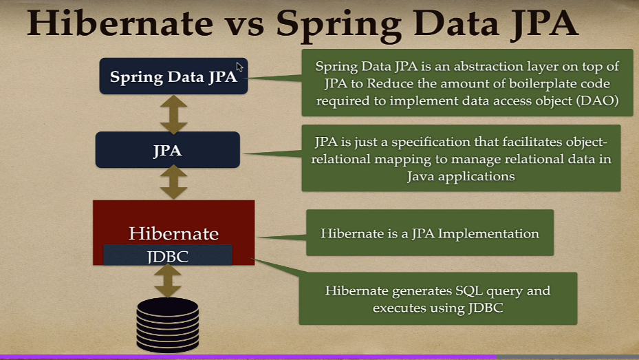

#### 9.1 Spring Boot Data JPA

Spring Boot Data JPA là một phần mở rộng của Spring Boot Framework, được sử dụng để làm việc với cơ sở dữ liệu quan hệ trong ứng dụng Java. JPA là viết tắt của Java Persistence API, là một tiêu chuẩn Java để tương tác với cơ sở dữ liệu quan hệ.

Spring Boot Data JPA cung cấp các tính năng và tiện ích để giảm thiểu công việc lập trình liên quan đến tạo, truy vấn và cập nhật dữ liệu trong cơ sở dữ liệu quan hệ. Nó cung cấp một cách dễ dàng để thao tác với cơ sở dữ liệu thông qua các thao tác CRUD (Create, Read, Update, Delete) thông qua các Repository.

Để sử dụng Spring Boot Data JPA, bạn cần cấu hình các thuộc tính liên quan đến cơ sở dữ liệu trong tệp cấu hình của ứng dụng và tạo các Repository để thực hiện các thao tác trên đối tượng dữ liệu. Spring Boot Data JPA sẽ tự động tạo các truy vấn SQL dựa trên tên phương thức trong Repository và cung cấp các phương thức tiện ích để thực hiện các truy vấn phức tạp hơn.

Với Spring Boot Data JPA, bạn có thể tiết kiệm thời gian và công sức trong việc xây dựng lớp truy cập cơ sở dữ liệu, giảm thiểu công việc lập trình và tăng tốc độ phát triển ứng dụng Java của bạn.

#### 9.2 ORM ?

ORM( Object - Relational Mapping) là một kĩ thuật trong lập trình phần mềm để ánh xạ dữ liệu giữa cơ sở dữ liệu quan hệ (Relational Database) và các đối tượng (object) trong ngôn ngữ lập trình hướng dối tượng.

Khi sử dụng ORM, ta có thể làm việc với cơ sở dữ liệu mà không cần viết các truy vấn SQL trực tiếp, mà thay vào đó sử dụng các đối tượng và phương thức của ngôn ngữ lập trình hướng đối tượng. ORM cung cấp một lớp trung gian giữa ứng dụng và cơ sở dữ liệu, giúp quản lí và ánh xạ dữ liệu giữa hai hệ thống này.

Các ORM framework như Hibernate, Spring Data JPA và Entity Framework (trong .NET) cung cấp các cơ chế ánh xạ  các đôi tương Java/.NET và các bảng trong cơ sở dữ liệu. ORM framework tự động tạo và thực thi các truy vấn SQL cần thiết để thực hiện các thao tác CRUD (Create, Read, Update, Delete) trên cơ sở dữ liệu, và cung cấp các tính năng khác như quản lý mối quan hệ giữa các đối tượng, caching, và quản lý phiên (session management).

#### 9.3 JPA ?

JPA (Java Persistence API) là một giao diện lập trình ứng dụng trong Java để quản lý sự tương tác giữa các đối tượng Java và cơ sở dữ liệu quan hệ. JPA là một phần của Java EE (Java Enterprise Edition) và cũng được hỗ trợ trong các ứng dụng Java SE (Java Standard Edition).

JPA cung cấp một cách tiêu chuẩn để ánh xạ các đối tượng Java thành các bảng trong cơ sở dữ liệu quan hệ và ngược lại, tức là ORM (Object-Relational Mapping). Nó giúp giảm bớt công việc lập trình khi làm việc với cơ sở dữ liệu, vì bạn không cần phải viết các truy vấn SQL trực tiếp.

Với JPA, bạn có thể sử dụng các annotation và các lớp API để mô tả quan hệ giữa các đối tượng Java và bảng trong cơ sở dữ liệu. JPA cung cấp các tính năng như quản lý chu kỳ cuộc sống (lifecycle) của đối tượng, quản lý mối quan hệ giữa các đối tượng, truy vấn dữ liệu và các tính năng khác như caching và transaction.

JPA không chỉ hỗ trợ ORM mà còn cung cấp cách tiêu chuẩn để làm việc với các đối tượng liên quan đến cơ sở dữ liệu như EntityManager để quản lý quá trình lưu trữ và truy vấn dữ liệu, và JPQL (Java Persistence Query Language) để thực hiện các truy vấn dữ liệu linh hoạt và cấu trúc.

Các framework ORM như Hibernate, EclipseLink và Apache OpenJPA hiện thực JPA và cung cấp cách thức để triển khai JPA trong các ứng dụng Java.

#### 9.4 Hibernate ?

Hibernate là một framework ORM (Object-Relational Mapping) phổ biến trong ngôn ngữ Java. Nó cung cấp các công cụ và thư viện để ánh xạ dữ liệu giữa các đối tượng Java và cơ sở dữ liệu quan hệ.

Được phát triển bởi nhóm Hibernate tại Red Hat, Hibernate là một công cụ mạnh mẽ cho việc thao tác dữ liệu trong ứng dụng Java. Nó giúp giảm bớt công việc lập trình khi làm việc với cơ sở dữ liệu bằng cách tự động ánh xạ các đối tượng Java vào các bảng trong cơ sở dữ liệu quan hệ và ngược lại.

Các tính năng và lợi ích của Hibernate bao gồm:

1. **ORM (Object-Relational Mapping):** Hibernate sử dụng các mapping metadata (ví dụ: annotation hoặc XML) để ánh xạ các đối tượng Java thành các bảng trong cơ sở dữ liệu quan hệ. Điều này cho phép bạn thao tác với cơ sở dữ liệu bằng cách làm việc với các đối tượng Java thân thiện hơn.
2. **Quản lý chu kỳ cuộc sống (Lifecycle Management):** Hibernate quản lý chu kỳ cuộc sống của các đối tượng trong ứng dụng, bao gồm việc tạo, đọc, cập nhật và xóa dữ liệu. Nó tự động quản lý các thay đổi và cung cấp các phương thức và sự kiện để xử lý việc thay đổi trạng thái của đối tượng.
3. **Caching:** Hibernate hỗ trợ các cơ chế caching để cải thiện hiệu suất truy cập dữ liệu. Nó sử dụng cache cấp đối tượng và cache cấp truy vấn để lưu trữ các đối tượng và kết quả truy vấn để truy cập nhanh hơn và giảm tải cho cơ sở dữ liệu.
4. **Truy vấn dữ liệu:** Hibernate cung cấp Hibernate Query Language (HQL) để thực hiện các truy vấn dữ liệu linh hoạt và cấu trúc. HQL tương tự như SQL, nhưng nó sử dụng cú pháp dựa trên đối tượng và hỗ trợ ánh xạ đối tượng trong câu truy vấn.
5. **Quản lý mối quan hệ (Relationship Management):** Hibernate cho phép bạn mô hình hóa các mối quan hệ giữa các đối tượng trong ứng dụng. Nó hỗ trợ các mối quan hệ một-đến-một, một-đến-nhiều và nhiều-đến-nhiều,

#### 9.5 JPA và Hibernate ?

> JPA là tập các giao diện (interfaces), qui chuẩn, định nghĩa. còn Hibernate thực hiện cài đặt (implements) các giao diện đó, định nghĩa đó.

JPA (Java Persistence API) và Hibernate là hai khái niệm có liên quan nhưng không hoàn toàn giống nhau. Dưới đây là sự khác biệt và mối quan hệ giữa JPA và Hibernate trong ngôn ngữ Java:

1. **JPA (Java Persistence API):**

   - JPA là một giao diện lập trình ứng dụng trong Java để quản lý tương tác giữa các đối tượng Java và cơ sở dữ liệu quan hệ.
   - JPA là một phần của Java EE (Java Enterprise Edition) và cũng được hỗ trợ trong Java SE (Java Standard Edition).
   - Nó cung cấp một tiêu chuẩn để ánh xạ các đối tượng Java thành các bảng trong cơ sở dữ liệu quan hệ và ngược lại (ORM).
   - JPA định nghĩa các annotation và các lớp API để mô tả quan hệ giữa các đối tượng Java và bảng trong cơ sở dữ liệu.
   - JPA cung cấp các tính năng như quản lý chu kỳ cuộc sống của đối tượng, quản lý mối quan hệ giữa các đối tượng, truy vấn dữ liệu và các tính năng khác.
2. **Hibernate:**

   - Hibernate là một framework ORM (Object-Relational Mapping) phổ biến trong ngôn ngữ Java.
   - Nó triển khai và tuân theo tiêu chuẩn JPA và cung cấp các công cụ và thư viện để ánh xạ dữ liệu giữa các đối tượng Java và cơ sở dữ liệu quan hệ.
   - Hibernate cung cấp các tính năng mạnh mẽ để quản lý và thao tác dữ liệu, bao gồm quản lý chu kỳ cuộc sống của đối tượng, quản lý mối quan hệ, truy vấn dữ liệu, caching và nhiều tính năng khác.
   - Hibernate là một trong những triển khai JPA phổ biến nhất và được sử dụng rộng rãi trong cộng đồng Java.

Tóm lại, JPA là một giao diện lập trình ứng dụng trong Java để quản lý tương tác giữa các đối tượng Java và cơ sở dữ liệu quan hệ, trong khi Hibernate là một framework ORM triển khai JPA, cung cấp các công cụ và thư viện để ánh xạ dữ liệu giữa các đối tượng Java và cơ sở dữ liệu quan hệ. Hibernate được sử dụng rộng rãi và là một trong những triển khai JPA phổ biến nhất trong Java.


#### 9.6 Spring Data JPA ?

Spring Data JPA là một phần của Spring Framework và cung cấp một cách thuận tiện và mạnh mẽ để làm việc với cơ sở dữ liệu quan hệ trong ứng dụng Java. JPA (Java Persistence API) là một quy chuẩn Java để quản lý đối tượng trong cơ sở dữ liệu quan hệ.

Spring Data JPA kết hợp Spring Framework với JPA và cung cấp một cách tiện lợi để tương tác với cơ sở dữ liệu qua các đối tượng Java thay vì viết các truy vấn SQL trực tiếp. Nó giúp giảm bớt công việc lặp lại và mã nguồn được quản lý tốt hơn.

Spring Data JPA cung cấp một số chức năng như:

1. Tạo và cập nhật các bản ghi trong cơ sở dữ liệu qua các đối tượng Java.
2. Tìm kiếm và truy vấn dữ liệu sử dụng các phương thức đơn giản và các tiêu chí tìm kiếm.
3. Hỗ trợ việc phân trang dữ liệu.
4. Tự động tạo các truy vấn dựa trên tên phương thức.
5. Hỗ trợ các mối quan hệ giữa các đối tượng thông qua các annotation như @OneToOne, @OneToMany, @ManyToOne, @ManyToMany.
6. Tự động tạo ra các truy vấn SQL dựa trên cấu trúc của các đối tượng và các quy tắc được định nghĩa.

Spring Data JPA giúp cho việc làm việc với cơ sở dữ liệu trở nên dễ dàng hơn và giảm thiểu số lượng mã lặp lại trong ứng dụng. Nó cung cấp tính năng mạnh mẽ và linh hoạt để tương tác với cơ sở dữ liệu quan hệ trong môi trường phát triển Java.

#### 9.7 JPA, JPA Provider, HIbernate, Spring Data JPA ?

Spring Data JPA, Hibernate, JPA và JPA provider là các khái niệm liên quan đến việc làm việc với cơ sở dữ liệu quan hệ trong môi trường phát triển Java. Dưới đây là giải thích về mỗi khái niệm và mối quan hệ giữa chúng:

1. JPA (Java Persistence API): JPA là một quy chuẩn Java để làm việc với cơ sở dữ liệu quan hệ từ các ứng dụng Java. Nó định nghĩa các API (Application Programming Interface) và quy tắc để ánh xạ đối tượng Java vào cơ sở dữ liệu quan hệ. JPA cung cấp các annotation, interface và API để thực hiện các hoạt động CRUD (Create, Read, Update, Delete) trên cơ sở dữ liệu.
2. JPA provider: JPA provider là một thư viện hoặc framework cung cấp implement cho JPA. Nó cung cấp các lớp và phương thức cần thiết để triển khai và thực thi JPA. Hibernate là một ví dụ của JPA provider phổ biến. Ngoài Hibernate, còn có các JPA provider khác như EclipseLink, OpenJPA, và TopLink.
3. Hibernate: Hibernate là một JPA provider phổ biến và mạnh mẽ. Nó cung cấp implement cho JPA và cho phép bạn tương tác với cơ sở dữ liệu quan hệ bằng cách ánh xạ các đối tượng Java vào cơ sở dữ liệu. Hibernate hỗ trợ nhiều tính năng như ánh xạ đối tượng-quan hệ (ORM - Object-Relational Mapping), tạo tự động cấu trúc cơ sở dữ liệu, quản lý session và giao dịch, và nhiều hơn nữa.
4. Spring Data JPA: Spring Data JPA là một dự án con của Spring Data trong Spring Framework. Nó kết hợp Spring Framework với JPA và cung cấp một cách tiện lợi để làm việc với cơ sở dữ liệu quan hệ trong ứng dụng Java. Spring Data JPA cung cấp các lớp trừu tượng như JpaRepository để thực hiện các hoạt động CRUD và tìm kiếm dữ liệu thông qua JPA. Nó giúp giảm bớt công việc lặp lại và quản lý mã nguồn dễ dàng hơn.

Vì vậy, mối quan hệ giữa chúng là:
Spring Data JPA sử dụng JPA làm quy chuẩn và kế thừa từ JPA API để làm việc với cơ sở dữ liệu. Hibernate là một JPA provider phổ biến được sử dụng bởi Spring Data JPA để triển khai

 JPA và cung cấp các tính năng ORM mạnh mẽ. Do đó, khi sử dụng Spring Data JPA, bạn có thể sử dụng JPA và Hibernate như các công cụ để làm việc với cơ sở dữ liệu quan hệ trong ứng dụng Java của mình.



> Spring Data JPA sử dụng HIbernate làm JPA provider mặc đinh.

#### 9.8 Basic Flow of Spring Data JPA


#### 9.9 Using JPA Annotation

> JPA Annotation sử dụng Hibernate làm JPA provider mặc định nên JPA Annotation cũng chính là Hibernate Annotation.

##### 9.9.1  @Entity

Trong Hibernate JPA, `@Entity` là một annotation được sử dụng để đánh dấu một lớp (class) là một thực thể (entity) trong cơ sở dữ liệu. Annotation này giúp Hibernate nhận biết và quản lý các đối tượng của lớp tương ứng trong cơ sở dữ liệu.

Khi một lớp được đánh dấu bằng `@Entity`, Hibernate sẽ tự động tạo bảng tương ứng trong cơ sở dữ liệu hoặc ánh xạ với một bảng đã tồn tại nếu có. Các thuộc tính của lớp được ánh xạ thành các cột trong bảng. Hibernate cung cấp các annotation khác nhau để điều chỉnh ánh xạ này, chẳng hạn như `@Column`, `@Id`, `@GeneratedValue`, vv.

```java
import javax.persistence.Entity;
import javax.persistence.Id;

@Entity
public class Product {
    @Id
    private Long id;
  
    private String name;
  
    private double price;
  
    // constructors, getters, setters, etc.
}

```

Trong ví dụ trên, lớp `Product` được đánh dấu là một entity bằng `@Entity`. Thuộc tính `id` được đánh dấu là khóa chính (primary key) của entity bằng `@Id`. Hibernate sẽ sử dụng các quy tắc ánh xạ mặc định để tạo bảng trong cơ sở dữ liệu có các cột tương ứng với các thuộc tính `id`, `name`, và `price`.

Lưu ý rằng để sử dụng `@Entity`, bạn cần cấu hình và khởi tạo Hibernate trong ứng dụng của mình. Bạn cần đảm bảo rằng các thư viện Hibernate JPA và các cấu hình liên quan được thêm vào classpath của ứng dụng.

---

Trong Hibernate JPA, khi sử dụng annotation `@Entity` để đánh dấu một lớp là một thực thể (entity), các thuộc tính trong lớp đó sẽ được ánh xạ vào các cột trong bảng tương ứng trong cơ sở dữ liệu. Dưới đây là một số annotation phổ biến mà bạn có thể sử dụng để điều chỉnh cách ánh xạ các thuộc tính trong `@Entity`:

1. `@Id`: Đánh dấu thuộc tính là khóa chính (primary key) của entity.
2. `@GeneratedValue`: Xác định cách sinh giá trị cho khóa chính. Có thể sử dụng các strategy như `AUTO`, `IDENTITY`, `SEQUENCE`, `TABLE` để chỉ định cách sinh giá trị.
3. `@Column`: Xác định thuộc tính được ánh xạ vào một cột trong bảng. Bạn có thể chỉ định tên cột, kiểu dữ liệu, độ dài, ràng buộc, vv.
4. `@Transient`: Đánh dấu thuộc tính không được ánh xạ vào cơ sở dữ liệu. Thông thường sử dụng cho các thuộc tính tạm thời hoặc tính toán dưới dạng tính toán.
5. `@OneToOne`, `@OneToMany`, `@ManyToOne`, `@ManyToMany`: Định nghĩa các mối quan hệ giữa các entity, chẳng hạn như mối quan hệ một một, một nhiều, nhiều một, nhiều nhiều.
6. `@JoinColumn`: Xác định cột tham chiếu cho quan hệ thông qua khóa ngoại.
7. `@Temporal`: Xác định kiểu thời gian (DATE, TIME, TIMESTAMP) cho thuộc tính ngày tháng.

Dưới đây là một ví dụ minh họa về việc sử dụng các annotation trên thuộc tính trong `@Entity`:

```java
@Entity
public class Product {
    @Id
    @GeneratedValue(strategy = GenerationType.IDENTITY)
    private Long id;
  
    @Column(name = "product_name", nullable = false, length = 50)
    private String name;
  
    @Column(precision = 8, scale = 2)
    private BigDecimal price;
  
    @ManyToOne
    @JoinColumn(name = "category_id")
    private Category category;
  
    // Constructors, getters, setters, etc.
}

```

##### 9.9.2 @Table

Trong Hibernate, `@Table` là một annotation được sử dụng để định nghĩa thông tin về bảng trong cơ sở dữ liệu tương ứng với một entity. Annotation `@Table` có thể được sử dụng để **tùy chỉnh tên bảng, schema, các ràng buộc, vv.** Dưới đây là một số thuộc tính phổ biến trong `@Table`:

1. `name`: Xác định tên của bảng trong cơ sở dữ liệu. Mặc định, Hibernate sẽ sử dụng tên của entity tương ứng làm tên bảng. Bạn có thể sử dụng thuộc tính `name` để chỉ định một tên tùy chỉnh cho bảng.
2. `schema`: Xác định schema của bảng. Nó chỉ được sử dụng khi bạn làm việc với nhiều schema trong cơ sở dữ liệu và muốn chỉ định schema cho bảng.
3. `catalog`: Xác định catalog của bảng. Nó chỉ được sử dụng khi bạn làm việc với nhiều catalog trong cơ sở dữ liệu và muốn chỉ định catalog cho bảng.
4. `uniqueConstraints`: Định nghĩa các ràng buộc duy nhất (unique constraints) cho bảng. Bạn có thể chỉ định các cặp cột có ràng buộc duy nhất bằng cách sử dụng một mảng của các annotation `@UniqueConstraint`.

Dưới đây là một ví dụ minh họa về việc sử dụng `@Table` trong Hibernate:

```java
@Entity
@Table(name = "products", schema = "public", uniqueConstraints = {
    @UniqueConstraint(columnNames = {"name"}),
    @UniqueConstraint(columnNames = {"category_id", "price"})
})
public class Product {
    @Id
    @GeneratedValue(strategy = GenerationType.IDENTITY)
    private Long id;
  
    @Column(name = "name", nullable = false)
    private String name;
  
    @Column(name = "price", precision = 8, scale = 2)
    private BigDecimal price;
  
    @ManyToOne
    @JoinColumn(name = "category_id")
    private Category category;
  
    // Constructors, getters, setters, etc.
}

```

##### 9.9.3 @GeneratedValue

Trong Spring Data JPA, @GeneratedValue là một annotation được sử dụng để chỉ định cách sinh giá trị cho một trường đánh dấu khóa chính (primary key) của một đối tượng trong quá trình lưu trữ và truy vấn dữ liệu.

@GeneratedValue hoạt động cùng với @Id annotatin để xác định đực trường được đánh dấu là khóa chính. Có một `Strategy` khác nhau có để sử dụng với GenerationType để chỉ định các sinh giá trị khóa chính, bao gồm :

1. GenerationType.IDENTITY: Sử dụng cơ chế sinh khóa tự động của cơ sở dữ liệu. Cơ sở dữ liệu sẽ tạo và quản lý giá trị khóa chính tự động khi một bản ghi mới được chèn vào cơ sở dữ liệu. Đây là một chiến lược phổ biến trong các cơ sở dữ liệu hỗ trợ tự động tăng như MySQL hoặc SQL Server.
2. Ví dụ:

```java
@Id
@GeneratedValue(strategy = GenerationType.IDENTITY)
private Long id;
```

2. GenerationType.SEQUENCE: Sử dụng một trình tạo số (sequence generator) để sinh khóa chính. Trình tạo số sinh ra các số duy nhất và tăng dần cho khóa chính. Chiến lược này thích hợp cho các cơ sở dữ liệu hỗ trợ trình tạo số như PostgreSQL.

Ví dụ:

```java
@Id
@GeneratedValue(strategy = GenerationType.SEQUENCE)
private Long id;
```

> Trình tạo số (@SequenceGenerator) là một annotation đựơc sử dụng để xác định một trình tạo số cho việc sinh khóa chính dựa trên chuỗi số tăng dần. Annotation này được sử dụng với @GeneratedValue để chỉ định `Stategies` sinh gía trị khóa chính là Sequence.

Để sử dụng `@SequenceGenerator`, ta cần xác định  các thuộc tính sau :

- name : Tên của trình tạo số (sequence generator).
- sequenceName : Tên của chuỗi số trong cơ sở dữ liệu.
- initialValue(option) : Giá trị khởi khởi tạo đầu tiên cho chuỗi số. Mặc định là 1.
- allocationSize (option) : số lượng giá trị được cấp pháp cho mỗi lần gọi chuỗi số. Mặc định là 50.

Sau đó, ta sử dụng @GeneratedValue vớ `strategy = GenerationType.SEQUENCE` và `generator = "name" của @SenquenceGenerator` để áp dụng trình tạo số đã xác định cho khóa chính của đối tượng.

1. GenerationType.TABLE: Sử dụng một bảng đặc biệt để lưu trữ và sinh khóa chính. Cơ sở dữ liệu sẽ sử dụng bảng này để tạo ra các giá trị khóa chính duy nhất cho các bản ghi. Đây là một chiến lược phổ biến trong các cơ sở dữ liệu không hỗ trợ tự động tăng như Oracle.

Ví dụ:

```java
@Id
@GeneratedValue(strategy = GenerationType.TABLE)
private Long id;
```

4. GenerationType.AUTO: Đây là giá trị mặc định cho strategy. Nó cho phép cơ sở dữ liệu tự động xác định chiến lược sinh khóa chính phù hợp dựa trên cấu hình và tính năng của cơ sở dữ liệu.

Ví dụ:

```java
@Id
@GeneratedValue(strategy = GenerationType.AUTO)
private Long id;
```

> Trong MySQL, GenerationType.Auto thường sẽ sử dụng `Strategy` là `GenerationType.Sequence` là mặc định.

Lưu ý rằng giá trị GenerationType.AUTO có thể không hoạt động đúng với tất cả các cơ sở dữ liệu, do đó, nếu bạn muốn xác định rõ chiến lược sinh khóa chính, hãy chọn một giá trị khác như IDENTITY, SEQUENCE, HOẶC TABLE tương ứng với cơ sở dữ liệu của bạn.

##### 9.9.4 @CreationTimestamp và @UpdateTimestamp

> @CreationTimeStamp và @UpdateTimeStamp là 2 phần của Hibernate ORM, 2 annotation này dùng để cập nhật các trường thời gian tạo và thời gian cập nhật trong đối tượng mà chúng ta tạo.

- `CreationTimeStamp` : khi một đối tượng mới được lưu trữ vào cơ sở dữ liệu (thao tác insert), trường được đánh dấu với @CreationTimestamp sẽ tự động đựơc cập nhật với gia trị hiện tại. Điều này đảm bảo chúng ta không cần phải thực hiện thiết lập thủ công thời gian tạo khi lưu trữ đối tượng.
- `UpdateTimestamp` : khi một đối tượng tồn tại và được cập nhật trong cơ sở dữ liệu (thao tác update), trừờng được đánh dấu @UpdateTimestamp sẽ tự động cập nhật thời gian khi đối tượng được update mà không cần phải thiết lập thủ công.

> Khi ta sử dụng 2 annotation này thì Hibernate sẽ tự động xử lí các trường thời gian tạo và thời gian cập nhật cho chúng ta. Ta không cần phải thiết lập thông qua câu lệnh thủ công. Khi sử dụng 2 annotation này thì cần khai báo kiểu dữ liệu thích hợp để lưu trữ thời gian. Ví dụ trong LocalDateTime hoặc Timestamp trong java.

##### 9.9.5 LomBook ?

> Lombook là một thư viện Java được sử dụng để giảm bớt việc viết mã boilerplate (mã lặp lại) trong các đối tượng. Nó cung cấp các Annotation để tự động tạo các phương thức Setter, Getter, Constructor, .... cho các trừng trong lớp.

Lombok giúp viết code ngắn gọn hơn và giảm bớt công việc lặp lại khi tạo các phương thức getter/setter và các phương thức đặc biệt khác. Thay vì bạn phải viết các phương thức này thủ công, bạn chỉ cần sử dụng các annotation của Lombok và Lombok sẽ tự động tạo các phương thức này cho bạn trong quá trình biên dịch.

##### 9.9.6 Spring Data JPA Repository Interface và Cấu Trúc Phân tần của nó.


Spring Data JPA Repository là một tầng trung gian giữa ứng dụng của bạn và cơ sở dữ liệu. Nó cung cấp một cách tiện lợi để tương tác với cơ sở dữ liệu bằng cách sử dụng các phương thức trừu tượng mà bạn không cần phải triển khai thủ công. Repository định nghĩa các phương thức tiêu chuẩn để thao tác với dữ liệu, chẳng hạn như tạo, đọc, cập nhật và xóa (CRUD operations).

Hierachy (cấu trúc phân cấp) của Spring Data JPA Repository bao gồm các lớp và interface sau đây:

1. Repository: Đây là interface cơ bản nhất trong hierachy. Nó định nghĩa các phương thức CRUD cơ bản như `save()`, `findById()`, `findAll()`, `delete()`, v.v. Các interface Repository không cung cấp khả năng truy vấn phức tạp hơn.
2. CrudRepository: Kế thừa từ Repository và mở rộng chức năng của nó bằng cách cung cấp các phương thức tiện ích CRUD. Ngoài các phương thức CRUD cơ bản, CrudRepository cũng cung cấp các phương thức như `count()`, `existsById()`, `findAllById()`, v.v.
3. PagingAndSortingRepository: Kế thừa từ CrudRepository và mở rộng khả năng phân trang và sắp xếp dữ liệu. Nó cung cấp các phương thức như `findAll(Pageable pageable)`, `findAll(Sort sort)`, v.v. để hỗ trợ phân trang và sắp xếp kết quả truy vấn.
4. JpaRepository: Kế thừa từ PagingAndSortingRepository và cung cấp các phương thức truy vấn bổ sung. JpaRepository hỗ trợ các phương thức truy vấn động bằng cách sử dụng `@Query` và cung cấp các phương thức tiện ích như `flush()`, `saveAndFlush()`, `deleteInBatch()`, v.v.
5. JpaSpecificationExecutor: Đây là một interface riêng biệt không có sự phụ thuộc vào hierachy trên. Nó cung cấp khả năng tìm kiếm dựa trên các tiêu chí động (dynamic criteria) bằng cách sử dụng Specifications.

Khi sử dụng Spring Data JPA Repository, bạn có thể tạo interface cho lớp đối tượng của mình và kế thừa các interface trong hierachy trên. Spring Data JPA sẽ tự động tạo các phương thức thích hợp cho bạn dựa trên tên phương thức. Bạn cũng có thể tạo các phương thức truy vấn động bằng cách sử dụng các annotation như `@Query`, `@NamedQuery` hoặc `@QuerydslPredicate`.

Ví dụ:

```java
import org.springframework.data.jpa.repository.JpaRepository;

public interface UserRepository extends JpaRepository<User, Long> {
    List<User> findByLastName(String lastName);
}
```

Trong ví dụ trên, `UserRepository` kế thừa từ `JpaRepository` và cung cấp một phương thức tìm kiếm `findByLastName()`. Khi bạn sử dụng `UserRepository`, bạn có thể gọi các phương thức như `save()`, `findAll()`, `findByLastName()`, v.v. mà không cần triển khai chúng một cách thủ công. Spring Data JPA sẽ tự động thực hiện các truy vấn phù hợp và xử lý các tác vụ liên quan đến cơ sở dữ liệu.


#### 9.10 Important Spring Data JPA Repository Methods

##### 9.10.1 Save() Method

Trong Spring Data JPA, phương thức `save()` được sử dụng để lưu trữ hoặc cập nhật một đối tượng vào cơ sở dữ liệu. Spring Data JPA cung cấp một số phiên bản của phương thức `save()` để thao tác với đối tượng thực thể.

Dưới đây là một số biến thể của phương thức `save()`:

1. `save(Object entity)`: Phương thức này được sử dụng để lưu trữ một đối tượng thực thể vào cơ sở dữ liệu. Nếu đối tượng đã tồn tại trong cơ sở dữ liệu, nó sẽ được cập nhật. Nếu không tồn tại, nó sẽ được thêm vào cơ sở dữ liệu.

```java
userRepository.save(user); // Lưu hoặc cập nhật đối tượng người dùng vào cơ sở dữ liệu
```

2. `saveAll(Iterable<S> entities)`: Phương thức này được sử dụng để lưu trữ danh sách các đối tượng thực thể vào cơ sở dữ liệu. Nó sẽ tự động lưu trữ hoặc cập nhật từng đối tượng trong danh sách.

```java
List<User> users = new ArrayList<>();
// Thêm các đối tượng người dùng vào danh sách 'users'
userRepository.saveAll(users); // Lưu hoặc cập nhật danh sách người dùng vào cơ sở dữ liệu
```

3. `saveAndFlush(T entity)`: Phương thức này tương tự như `save()`, nhưng cũng gọi `flush()` sau khi lưu trữ đối tượng. `flush()` đẩy dữ liệu vào cơ sở dữ liệu ngay lập tức, thay vì đợi đến khi kết thúc giao dịch hoặc kết thúc phương thức.

```java
userRepository.saveAndFlush(user); // Lưu hoặc cập nhật đối tượng người dùng vào cơ sở dữ liệu và đẩy dữ liệu vào cơ sở dữ liệu ngay lập tức
```

Nhớ kiểm tra tài liệu của Spring Data JPA và đảm bảo rằng bạn đã cấu hình đúng các repository và thực thể của mình để sử dụng các phương thức này một cách chính xác.
